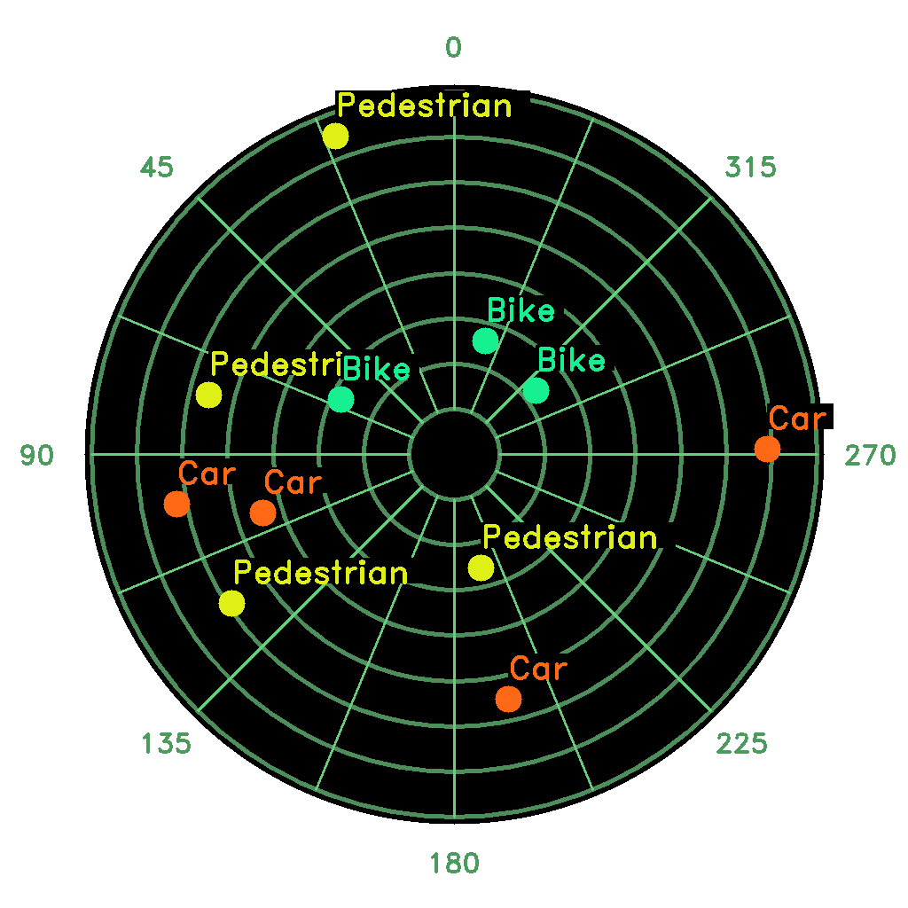

<div align="center">

# ROS Radar-View


</div>

This ROS package allow you to generate a radar like map using relative coordinate to the center, like as below.

<div align="center">



**Fig.1** RViz screenshot of the radar-view with multiples points
</div>

## :rocket: Quick start


### 1. Installation from source

First you need to download all required source, like the [ros-image-transport-py](https://github.com/alexandrefch/ros-image-transport-py) package, that manage automaticly image stream.
Moreover you might need some python package like [OpenCV](https://github.com/opencv/opencv), you can install them by simply execute `pip install opencv-python` or better compile from source for GPU.

**Clone and Compile**

<font size=2>

Clone thoose two packages inside the `src` directory of your catkin workspace.

```shell
git clone https://github.com/alexandrefch/radar-view.git
git clone https://github.com/alexandrefch/ros-image-transport-py.git
```

</font>

Now you can compile them using your catkin tool (`catkin_make`, `catkin_build` ...).

### 2. Custom launch file

<font size=2>

Here you can find an example launch file where each parameters are described.

```xml
<?xml version="1.0"?>
<launch>
    <node pkg="radar_view" type="RadarView.py" name="radar_view">
        <!-- [optional] Update frequency (default=10hz) -->
        <param name="frequency" type="int" value="10"/>
        <!-- Input topic name -->
        <param name="input_topic" type="str" value="/path_to_your_input_topic"/>
        <!-- Output topic name (type is sensor_msgs.msg.Image) -->
        <param name="output_topic" type="str" value="/path_to_your_output_topic"/>
        <!-- [optional] Map resolution in pixel (default=1024px) -->
        <param name="map_resolution" type="int" value="1024"/>
        <!-- [optional] Map range in meter (default=80.0m) -->
        <param name="map_range" type="double" value="80.0"/>
        <!-- [optional] Map graduation distance (default=10.0m) -->
        <param name="map_graduation" type="double" value="10.0"/>
        <!-- [optional] Use clockwise angle (default=false) -->
        <param name="clockwise" type="bool" value="true"/>
    </node>
</launch>
```

</font>

### :incoming_envelope: Messages

**RadarObj.msg**

The position `x` and `y` are relative to the center of the map, that mean that the center of the map is `(0;0)`, `label` and `color` param are optional you don't need to fill them to make a point appear on the map.

<font size=2>

```py
float32 x                # x position [m]
float32 y                # y position [m]
string label             # obj label (optional)
std_msgs/ColorRGBA color # obj color (optional)
```

</font>

**RadarObjArray.msg**

<font size=2>

```py
radar_view/RadarObj[] objects
```

</font>
