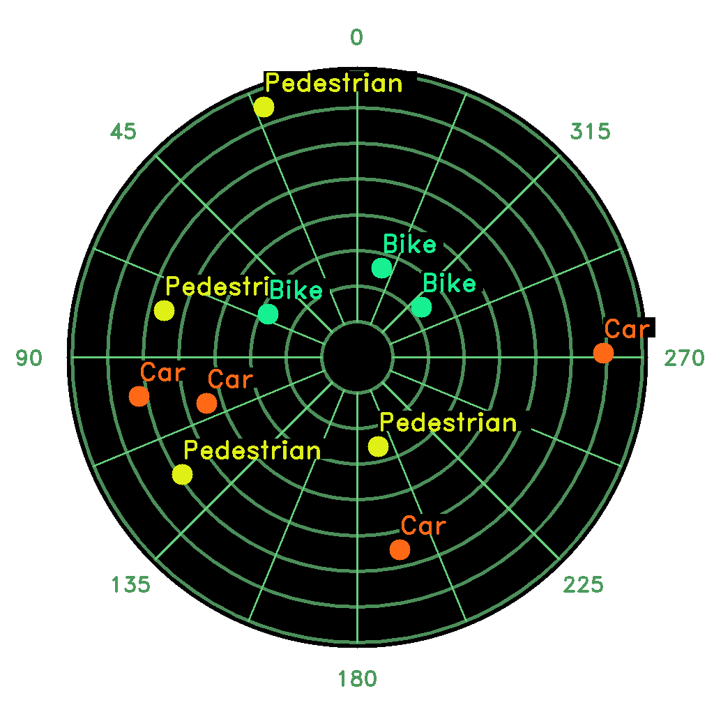

<div align="center">

# ROS Radar-View


</div>

<div align="center">



**Fig.1** RViz screenshot of the radar-view with multiples points
</div>

### :rocket: Quick start

**Clone**

<font size=2>

```shell
git clone https://github.com/alexandrefch/radar-view.git
```

</font>

**Compile**

<font size=2>

```shell
catkin_make
```

</font>

**Add node in launch file**

<font size=2>

```xml
<?xml version="1.0"?>
<launch>
    <node pkg="radar_view" type="RadarView.py" name="radar_view">
        <!-- Update frequency (default=10hz) -->
        <param name="frequency" type="int" value="10"/>
        <!-- Input topic name -->
        <param name="input_topic" type="str" value="/path_to_your_input_topic"/>
        <!-- Output topic name (type is sensor_msgs.msg.Image) -->
        <param name="output_topic" type="str" value="/path_to_your_output_topic"/>
        <!-- Map resolution in pixel (default=1024px) -->
        <param name="map_resolution" type="int" value="1024"/>
        <!-- Map range in meter (default=80.0m) -->
        <param name="map_range" type="double" value="80.0"/>
        <!-- Map graduation distance (default=10.0m) -->
        <param name="map_graduation" type="double" value="10.0"/>
        <!-- Use clockwise angle (default=false) -->
        <param name="clockwise" type="bool" value="true"/>
    </node>
</launch>
```

</font>

### :incoming_envelope: Messages

**RadarObj.msg**

<font size=2>

```py
float32 x                # x position [m]
float32 y                # y position [m]
string label             # obj label (optional)
std_msgs/ColorRGBA color # obj color (optional)
```

</font>

**RadarObjArray.msg**

<font size=2>

```py
radar_view/RadarObj[] objects
```

</font>
